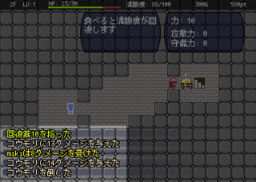
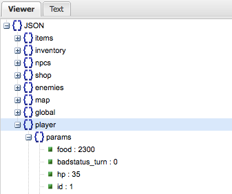
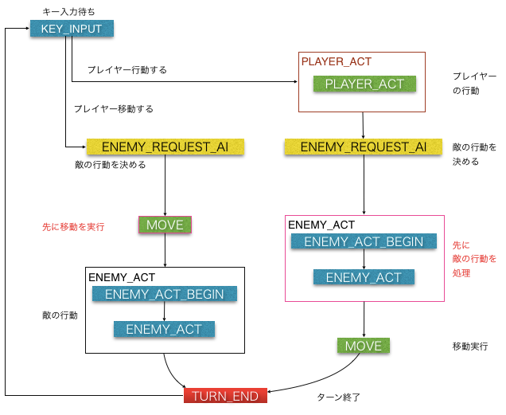
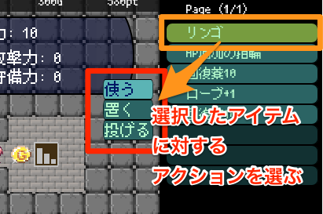
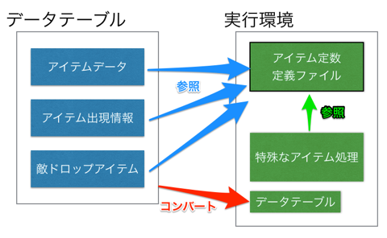

#ローグライクを作ったので開発手順をまとめてみた

自作のローグライクが完成したので、メモを残すために開発過程をまとめてみました。
開発するにあたり、「[ローグライクをつくる15のステップ](http://d.hatena.ne.jp/countable/20120717/1342505647)」をかなり参考にしたので、それをベースにローグライクを作るために必要な手順をまとめています。

なお注意点は、以下のとおりです。

* 必ずしもこの手順通りに作る必要はない。あくまで目安
* 実装例はあくまで例。この通りに実装する必要はない


## Step 1. Decide to write a game (がんばるぞ)
この段階では自分が作りたいローグライクをイメージします。

### ローグライクをひたすら遊ぶ
* トルネコやシレンは、和製ローグライクとしてかなり完成度が高いので、遊んでなかったら一度遊んでおいた方がよいかも
 * 最新作を手元に置いておくと、悩んだとき参考になる
 * とくにUIのレイアウトとか、表示する項目や、操作感とか
* Steamで、Roguelike タグがついているゲームをひたすら遊んでみるのもよいかもしれない

様々なローグを遊ぶと、自分の遊びたいローグライクのイメージが固まります。実際に作ってテストプレイを始めるまでにかなり時間がかかりますが、脳内プレイができればテストプレイもしやすいです。

また、既存のゲームをプレイしながら、自分の作りたいローグライクだったらどうなるかをイメージしてみるのもよいです。

### ローグライクの定義を知る
ローグライクはどういう要素の組み合わせで成り立っていることを知るのも、イメージを固めるのに役立ちます。

* [ローグライクの定義まとめ](http://2dgames.jp/2015/03/19/roguelike/)

詳細は上記ページにまとめましたが、ローグライクには「PDL」と「ベルリン解釈」という2つの分類があります。

簡単に説明すると、PDLは、ローグライクの主要な要素として、「Procedual(自動生成)」「Death(死)」「Labyrinth(迷宮)」の3つがあるとしました。

ベルリン解釈はそれをより深く定義し、ローグライクを強く感じさせる要素と、ローグライクっぽさを少しだけ出せる要素に分けました。
強い要素としては、「環境の自動生成」「死んだらすべてを失う」「ターン制」などです。弱い要素としては「操作できるプレイヤーは一人だけ」「プレイヤーと敵は同等の能力を持つ」「ASCII表示」なのです。

ただ、これらの要素はあくまでローグライクを理解するための解釈に過ぎず、これらの定義に該当しないからと言って、これはローグライクではない、ということを意味するものではありません。例えば「FTL」という戦術型のローグライクゲームでは、戦闘はシームレスに行わません。「Risk of Rain」というローグライクな横スクロールアクションゲームでは、ダンジョンは部分的な自動生成となっています。

### 他の人のローグライクに対する意見を聞いてみる
* ローグライクについて書いてあるブログを読んでみる
* 掲示板のローグライクの論争を読んでみる

## Step 2. Hello world! (環境を整えよう)
開発環境は、自分の作りやすい環境を選びます。基本的にどんな環境でも構いませんが、ローグライクはゲームデータの保存・読み込み処理を、柔軟に、いつでも行えるようにすると開発効率が良いので、ファイルの保存・読み込みや、文字列操作を簡単にできる（できればオブジェクトをJSONなどのテキストにシリアライズできる言語）を使った方がよいです。

2Dか3Dかは問いませんが、2Dだと実装は簡単ですが、4方向または8方向のキャラクター画像を用意するのが大変かもしれません。

## Step 3. It's a boy! (画面表示とキー入力)
### プレイヤーを画面に表示する
素材がなければひとまず矩形でもよいです。とりあえずフリー素材を使ってもよいです。

4方向移動のローグライクにするのであれば、上下左右に向いている画像を使います。8方向の場合は斜め向きの画像が必要となります。3Dだと向きに合わせてモデルを回転させるだけなので、その点は楽になるかもしれません。

また、方向の定数や列挙型(例えば上向きであれば「eDir.Up」など)を用意しておくと何かと便利です。

```cpp
/**
 * 方向を表す定数
 */
enum eDir {
  Left,  // 左
  Up,    // 上
  Right, // 右
  Down,  // 下
};
```

### グリッド移動の実装
グリッド（マス目）単位で移動をするゲームであれば、グリッド移動を実装します。

* 座標系は、グリッド座標系とスクリーン座標系(スクロールありであれば、さらにワールド座標系)の座標系を用意して、相互に変換できるようにする
* オブジェクトの座標は、基本的にはグリッド座標系で管理した方が都合が良い
 * 攻撃対象の判定やアイテムを拾う衝突判定など、グリッド座標系で処理した方が、処理も高速で位置関係もつかみやすくデバッグがやりやすい

#### 移動座標の計算方法
オブジェクトの移動は移動値を持たせるよりも、補完で計算した方が制御しやすいです。

```cpp
// 現在の座標をp1、移動先座標をp2、補完フレーム数をtとする
移動中の座標 = p1 + (p2 - p1) * t
(tは、0.0〜1.0)
```

### メッセージウィンドウの表示



* まずは文字列をテキストとして表示できるようにする
* どこのモジュールからでも、メッセージを追加できるようにする
* 次に複数のテキストを表示できるようにする
 * メッセージの管理をQueue(FIFO)で実装すると、表示最大数を超えたときに先頭のメッセージを消す、という処理がやりやすくなる

## Step 4. The Map (マップとマップオブジェクト)
### マップのデータ構造
マップは、整数値の配列で管理します。配列へのアクセスはX座標・Y座標を指定してアクセスできるクラスを用意しておくと便利です。

例えば、Array2Dというクラスを作るとします。

```cpp
// X/Y座標にある値を取得する
int Array2D::Get(int x, int y);

// X/Y座標に値(v)を設定する
int Array2D::Set(int x, int y, int v);
```

領域外にアクセスした場合は、例えば「-1」を返すという作りにしておくと、領域外アクセスエラーを気にする必要がなくなります。

### 壁との当たり判定
プレイヤーの移動先に壁があるかどうかチェックして、壁がある場合は移動できないようにします。この判定を行う関数は、移動方向を指定すると、移動先の座標を返却させます。

```cpp
/**
 * 2次元の座標クラス
 */
struct Pos2D {
  int x;
  int y;
};

/**
 * 現在の座標(position)と移動したい方向(dir)を渡すと
 * 移動先の座標を取得
 */
Pos2D DirUtil::Move(Pos2D position, eDir dir);
```

### フィールド情報の管理クラスの作成
この時点で、フィールド情報の管理用のクラス(Field)を実装しておくとよいかもしれません。

```cpp
// マップデータの生成
void Field::Create(Array2D mapdata);

// グリッド座標(X)をワールド座標(X)に変換
int Field::ToWorldX(int xgrid);

// グリッド座標(Y)をワールド座標(Y)に変換
int Field::ToWorldY(int ygrid);

// ワールド座標(X)をグリッド座標(X)に変換
int Field::ToGridX(int xworld);

// ワールド座標(Y)をグリッド座標(Y)に変換
int Field::ToGridY(int yworld);

// 指定の座標が壁かどうかをチェック
bool Field::IsCollide(xgrid, ygrid);
```

### マップデータの読み込み
後々にダンジョンを自動生成するにしても、この時点では「固定のマップデータ」を読み込む処理のみを実装しておきます。

* 特定の地形、ギミック(罠)でしか発生しない不具合が再現しやすくなる
* 自動生成を実装するには時間がかかる
 * 生成ロジックはそれなりに複雑
 * 生成されるダンジョンの調整まで含めると大変

自動生成は、ゲームがある程度完成してから実装して、後で差し替えられるようにしておきましょう。

マップエディタは、「[Tiled Map Editor](http://www.mapeditor.org)」が使いやすいので、おすすめです。また、データ形式はXMLでロードしやすいです。

## Step 5. Saving/Loading (保存と読み込み)
以下のゲームパラメータを保存します。

* プレイヤー情報
 * プレイヤーの座標(グリッド座標)
 * プレイヤーの向き
* マップデータ(壁)

この時点では、これだけなので難しくないはず。

### 保存データの形式
保存するデータの形式はJSONが扱いやすいです。開発環境にシリアライズする仕組みが用意されている前提ですが……。もしシリアライズできれば保存するデータのみのオブジェクトを定義し、それに値を代入しJSON形式にシリアライズします。

保存先はテキストファイルにして、目視できる情報にするとデバッグしやすいです。特にJSONであれば、「[Online JSON Viewer](http://jsonviewer.stack.hu)」などJSONを可視化するツールを使うことで視覚的にパラメータを確認しやすく、後々パラメータがたくさん増えたときに、おかしなパラメータが入っていないかどうか簡単にチェックできます。



「[Online JSON Viewer](http://jsonviewer.stack.hu)」を使うと、こんな感じでファイルに保存したパラメータの確認できます。すごく便利！

### 保存・読み込み処理のルール
保存・読み込み処理は、保存する（ゲーム状態の復元に必要な）パラメータが追加されたら、すぐにそれを保存・読み込めるように実装します。これを怠って後でまとめて実装しようとすると、複雑になって実装が難しくなります……。また、保存・読み込みの機能を常に使用可能な状態にしておくと、何か問題が起きたときの再現・テスト・動作確認が、素早く簡単にできるようになります。

なので、保存・読み込みは、いつでも使えるように、しっかりメンテナンスしておきましょう。

あと、この処理をショートカットキーとして割り当てておきます。例えば、保存をキーボードの「Sキー」、読み込みを「Lキー」にデバッグ用として割り当てておけば、トライ＆エラーが素早くできるようになります。

## Step 6. It's alice! Alive! (モンスターとターン制)
おそらくここが最初の難関となります。ターン制の実装はかなり複雑で、制御順を間違えるとすぐに動かなくなります。ちなみに「Risk of Rain」のようなリアルタイム(非ターン制)のローグライクを作るのであれば、この面倒な処理は実装不要となります。

### モンスター
通常、モンスターの処理はプレイヤーと共通する部分が多いです。そのため、プレイヤーの処理からモンスターにも流用できそうな部分は切り離して、基底クラスを作ります。そして、モンスターはその基底クラスを継承させます。


現時点では、座標や方向、グリッド単位での移動処理は共通で使うことになるので、このあたりを切り出しておきます。

### ターン制
ターン制でまず気をつけるべきことは、更新タイミングです。
もしゲームエンジンを使っているならば、ゲームエンジンに用意されている、いつ呼び出されるか分からない更新関数は使ってはいけません。

例えば、Unityであれば、 *MonoBehaviour.Update()* で行動処理を行わないようにします。理由は、更新の順番をこちらで制御して、更新タイミングの同期を取ることが難しくなるからです。

ということで、Actorクラスに新たに別の更新関数を用意します。例えばProcという名前の更新関数を用意して、行動処理はここで行うようにします。

#### Actorに必要な行動状態
基本的なターン制を実装するために、以下の状態定数(enum)を定義しておきます。

```cpp
/**
 * 行動状態
 */
enum eAct {
  KeyInput, // キー入力待ち。もしくは待機中
  
  // アクション
  ActBegin, // 開始
  Act,      // 実行中
  ActEnd,   // 終了
  // 移動
  MoveBegin, // 開始
  Move,      // 移動中
  MoveEnd,   // 完了
  
  TurnEnd,   // ターン終了
};
```

ここでのアクションとは、攻撃行動やアイテムを使ったりする動作を表します。移動は文字通り移動処理を行います。


ゲーム開始時には、 *KEY_INPUT* 状態となり入力を受け付けたり、プレイヤーが行動するまで待機します。
近くに敵がいて、それに対して攻撃する場合は *ACT_BEGIN* に遷移し、移動するのであれば *MOVE_BEGIN* に遷移します。
*ACT_BEGIN* / *MOVE_BEGIN* 状態になってもすぐには行動せずに、自分の行動順が回ってきたタイミングで、それぞれの行動を実行します。
行動が終わったら *TURN_END* となり、全員が *TURN_END* になったらターン終了です。そうしたら、全員を *KEY_INPUT* に戻します。

### シーケンス管理
各Actorの更新処理の呼び出しは、シーケンス管理クラスから行います。



トルネコ・シレン準拠の制御をすると基本のシーケンスはこのようになります。
*KEY_INPUT* ではプレイヤーの行動を監視し、移動以外の行動を行う場合は、プレイヤーの行動を実行します。
その後、敵の行動判定を行うが、プレイヤーが「移動」を選んだか、「行動」(攻撃など)を選んだかで処理順番が変わります。

* プレイヤーが移動 → 敵も一緒に動かすため移動を先に処理する
* プレイヤーが行動 → 敵を移動させてから行動処理をする

複数の敵が存在する場合は、処理の順番を間違えないようにシーケンスを制御しないとおかしなことになります。

無事、全員の移動・行動が完了すればターン終了となり、*KEY_INPUT*へ戻ります。

これら、シーケンスの制御は非常に複雑なので、手書きでもよいので一度シーケンスの流れを図にして、状況を整理しながら実装した方が結果的に無理なく実装できるはずです。

後々に、インベントリを実装したり、アイテムを投げたり、杖を使ったりする処理を実装すると、さらにシーケンスが複雑になります。
なので、その場合も図を見ながら整理できるように、図は残しておいた方がよいです。

## Step 7. Interaction (戦闘システム)

### キャラクターのステータスパラメータ
キャラクターのステータスパラメータを実装します。
ステータスパラメータは、別のデータ構造として定義しておきます。

```cpp
/**
 * キャラクターパラメータ
 */
class Params {
  int id;    // ユニークID
  int lv;    // レベル
  int hp;    // HP
  int hpmax; // 最大HP
  int str;   // 力
  int exp;   // 獲得した経験値
  int xp;    // 倒したときに得られる経験値
};
```

Actorとは別のデータオブジェクトとすることで、外部からこのパラメータを渡すことで、ステータスパラメータを設定することができるようになります。

IDは、プレイヤーを「0」、敵は「1」から開始、とするとIDでプレイヤーか敵かどうかを判定できます。
それが嫌な場合はキャラクター種別のパラメータを用意しておきます。

なお、ステータスパラメータが実装できたら、保存・読み込みができるようにしておきます。

### ダメージ計算式
キャラクターがお互いに殴り合えるようになったら、ダメージ計算式を作ります。
ダメージ計算式は色々な計算方法があるので、好みの方法を使うと良いです。

* ドラクエ(減算)方式: Aの攻撃力 - Bの防御力
* ポケモン(除算)方式: Aの攻撃力 / Bの防御力
* トルネコ(乗算)方式: Aの攻撃力 * (0.9375 ^ Bの防御力)

厳密にはもう少し細かいのですが、わかりやすいように式を簡略化しました。

減算方式は、ダメージ量が安定しやすいというメリットがあります。しかし、HPが少ないときには少しの差でダメージ量が多くなり、HPが多くなるとパラメータが上昇してもダメージ量が大きく変化しないです。

除算方式は、攻撃力と防御力が均衡している序盤ではダメージ量が抑えられますが、差が大きい場合にダメージ量が爆発的に増大するデメリットがあります。

乗算方式は、防御力が高くなるほど攻撃力への係数値が小さくなるという計算方法です。除算と同様に差が均衡している場合にはダメージ量を抑えやすいですが、差が開くとダメージ量が極端に大きくなります。

いずれを選ぶにしても、パラメータの差で極端なダメージ量が出ないように調整しなければなりません。
ローグライクはアイテムがランダムで出現するため、序盤で強力なアイテムを入手したり、終盤まで貧弱な装備で戦わなければならないことがよくあります。その場合でも、ある程度のゲームバランスを保つ必要があります。

対策としては、一般的なゲームがそうであるように、各パラメータには、プレイヤーのレベルによる補正を加えてダメージ値を調整した方がよいかもしれないです。

長くなってしまったが、この段階ではダメージ計算式は細かく調整してもあまり意味がない。計算式の調整は、敵やアイテムデータが出揃ったタイミングで行うようにします。

### 敵の移動AIの実装
敵のAIは、この時点では単純で頭の悪いAIで構わないです。例えば以下のように移動方向を決定します。

```cpp
// プレイヤーへの距離を求める
int dx = player.x - enemy.x;
int dy = palyer.y - enemy.y;

if(Math.abs(dx) > Math.abs(dy)) {
  // X方向への距離の方が遠いのでそっちに進む
  if(dx < 0) { return eDir.Left;  } // 左
  else       { return eDir.Right; } // 右
}
else {
  // Y方向へ進む
  if(dy < 0) { return eDir.Up;   } // 上
  else       { return eDir.Down; } // 下
}
```

ひとまず敵を動かすのであれば、これで充分です。たまに壁に引っかかって動けなくなりますが……。
最終的には、A*など賢く移動できるAIアルゴリズムの実装が必須となります。というのも、敵が壁に引っかかると、自然回復による体力回復が安全にできてしまうなど、ゲームデザイン的に致命的な問題となりやすいためです。

なお、A*の実装方法はこちらにまとめていますので、よかったら参考にしてみてください

* [よくわかるA*(A-star)アルゴリズム (Unity2Dのサンプルコードつき)](http://qiita.com/2dgames_jp/items/f29e915357c1decbc4b7)

ただローグライクで使うには、そのまま使うと重たい処理となってしまうので以下の工夫が必要です

* ダンジョン生成時に、つながっている部屋を判定するため情報を計算しておく
* プレイヤーと敵が同じ部屋にいない場合は、最短で移動可能な部屋の移動経路を探索する
* 同じ部屋に着いたらA*で経路探索

あと、大部屋になったら(壁がすべてなくなったら)A*を使わずに、先ほどのシンプルなアルゴリズムで移動するとよいかもしれません

## Step 8. Data files (データファイル)
キャラクターパラメータをデータ化します。
データ形式はExcelで記述し、PythonやRubyなどのスクリプトでCSVやXML、JSONなどに変換して読みます。Excelがそのまま読み込めるなら、Excelのままでも良いかもしれません。ただ、バイナリだと変更差分が取りづらいので、テキストで出力できるようにしておいた方が変更点を把握しやすいというメリットもあります。実装の手間はありますが、個人的にはテキスト出力できたほうが良いかと思います。

なお、Excelでデータを記述できると、セルの色を変えたりと、後々のパラメータ調整作業が楽になります。

プレイヤーのデータは、以下のものを記述できるようにします。

* プレイヤーの初期パラメータ
* レベルアップで上昇するパラメータ

レベルアップは *Step 12* で実装するので後回しでもよいです。

敵のデータは、敵IDに対応する、名前・画像ファイル名・ステータスパラメータを記述できるようにします。

実装できたら、追加したパラメータを保存・読み込みできるようにするのを、忘れずに実装します。

### メッセージデータ
メッセージウィンドウに表示する文字列データは、プログラムに直接書かずに、データ化しておくと多言語対応が楽になります。

そして、メッセージデータはタグで置き換え文字を指定できるようにします。

```python
# 敵にダメージを与えたメッセージ
<pc>は<enemy>に<val1>ダメージを与えた
```

実行時には、＜pc＞はプレイヤー名、＜enemy＞は敵の名前、＜val1＞はダメージ数値に置き換えて表示します。


## Step 9. Items (アイテム)
アイテムは自分から移動することはないので、Actorを継承する必要はありません。ですが、グリッド座標の扱いなどで、共通する部分が全くないわけではないので、Actorの上にさらに基底クラスを用意し、それを継承してもいいかもしれません。

* ひとまずは、ダンジョンにアイテムを配置できるようにする
* 次に、落ちているアイテムを保存・読み込みできるようにする

なお、*Step 9* と *Step 10* は交互に少しずつ実装していくことになる(一気に実装するのは難しいため)

### インベントリの実装
インベントリとは「倉庫」の意味で、アイテム管理のことです。
実はインベントリの実装は、第2の難関ではないかと思っています。例えば、足下にあるアイテムを拾ったり、投げたりする処理を実装するのはかなり大変です。

ひとまず、手順は以下の通りに進めると楽かもしれません

1. シーケンス管理に、インベントリを開くシーケンスを追加
2. インベントリを開く・閉じるを実装する
3. 所持アイテムの配列を用意する
4. アイテムとプレイヤーが重なったらアイテムを拾う
5. この時点ではアイテムIDはすべて「薬草」などで構わない
6. 保存・読み込みを実装し、拾ったアイテムが復元できることを確認する
7. 各アイテムを選択するカーソルの表示・移動を実装する
8. アイテムのサブメニューを実装する(使う・投げる・捨てる)。この段階はメニューの表示のみで良い
9. 「使う」を選んだら、選択しているアイテムを消滅させる
10. 「使う」を選んだら、ターンを経過させる

この段階ではアイテムの効果の実装はしません。



なお、ここで言う「サブメニュー」とは、選択したアイテムに対するアクションを選ぶメニュー（使う・置く・投げる）のことです。サブメニューの実装は、各コマンドの文字と、その文字に対応する処理をコールバック関数(デリゲート)で処理できるようにすると、拡張しやすくなるでしょう。

また、所持アイテムはこの段階ではアイテムIDの配列でも構いませんが、後々、アイテムの属性(+1など)や装備しているかどうか、など情報が必要となるので、いずれはアイテム情報の配列に置き換える必要があります。

```cpp
/**
 * アイテムリスト
 */
int[] _itemList; // ×：これだとアイテムIDしか保持できない

// ↓↓↓

ItemData[] _itemList; // ○：アイテム情報の配列にする

```

#### アイテムの装備
*Step10* で装備アイテムのカテゴリを作ってから実装することになりますが、インベントリで実装する項目なので、あらかじめここで手順を説明しておきます。

1. アイテム情報に装備しているかどうかのフラグを追加する
2. 装備品を選んでいる場合は、サブメニューに「装備」項目を追加する
 1. 「装備」を選ぶと、装備フラグを立てるようにする
 2. 例えば武器を1つしか装備できない場合は、「装備」を選んだ際に他に装備している武器の装備フラグを下げる
 3. 装備しているアイテムの隣には「E(Equip)」を表示する
3. 装備品を選んでいて、なおかつ、それを装備済みの場合は、サブメニューに「外す」を表示する
 1. 「外す」を選ぶと、装備フラグを下げる
 2. 「E」を非表示にする
4. ダメージ計算式に、装備品のパラメータを反映させる

なお、装備することでステータスパラメータに増減がある(例えば「力」が増加する指輪を装備する)場合は、Playerクラスに装備品によるパラメータ増減用のメンバ変数(拡張パラメータ)を追加します。

```cpp
class Player {

  ……

  // ステータスパラメータ
  Params _params;
  // 拡張パラメータ (一時的なパラメータの増減値)
  Params _extParams;

```

基本パラメータを直接、書き換えるのは避けた方が良いです。なぜかというと、増減値にバグがあった場合に合算された値となってしまうため、原因の調査がやりづらいです。また、パラメータを分けておくことで、装備を外した場合に増減値のリセットが実装しやすくなるというメリットもあります。

敵にもアイテムを装備させたいのであれば、Actorに拡張パラメータを定義して共通化するのもよいです。

#### インベントリのページ切り替え
トルネコやシレン準拠にする場合、所持アイテム数が8個を超えると、ページ切り替えが必要となります。ページ切り替え機能の実装手順は以下のとおりです。

1. ページ数の変数を用意する
2. 左右キーでページ数を増減させる
3. ページ数に応じて表示させるアイテムを変える
4. ページ数を切り替えてもアイテムが正しく使えることを確認する

#### 足下のアイテムを拾う
足下にアイテムがある状態でインベントリを開いた場合、足下アイテムのメニューを開く必要があります。トルネコ・シレン準拠とする場合は、ページ切り替え処理との共通化が必要となります。

以下、足下にアイテムがある場合の処理です。

1. 足下アイテム情報の配列(footItemList)を作る
2. 足下アイテムのページを開いたら、参照するアイテムリストを「footItemList」に差し替える
3. サブメニューに「拾う」を追加する

足下アイテムの表示項目を、足下アイテムのリスト「footItemList」と差し替えることで、通常のメニューと処理を共通化できます。他にも実装しなければいけない処理があって大変ですが、心が折れない程度に頑張りましょう。

* 足下アイテムは装備できない
* アイテム数が最大の場合は「拾う」は選べない
* 「交換」をサブメニューに追加する
* 拾い食いをする(足下にあるアイテムを使う)場合は、足下アイテムを消滅させる
* 足下アイテムを投げる場合は、足下アイテムを消滅させる

#### アイテムを投げる
アイテムを投げると、プレイヤーが向いている方向にアイテムを発射することができます。実装の手順は以下のとおりです。

1. まず、壁に当たって地面に落ちるようにする。投げた位置から落下する位置までワープして構わない（移動アニメーションの実装は後回し）
2. 次に、落下したアイテムを拾えることを確認する
3. 落下先にアイテムがある場合は、周囲の落下可能な位置に落とす
4. 周囲1マスに落下可能な場所がない場合は、消滅させてもよい
5. アイテムを敵にぶつけたら消える処理を実装する
  1. アイテムの効果が実装済みであれば、アイテムの効果を発動させる(敵にダメージなど)
5. シーケンス管理に「投げたアイテムの移動中」を追加し、移動アニメーションを実装する

もし「杖」アイテムを作る場合は、投げる処理と「杖」の魔法効果を共通化できるようにしておきます。

## Step 10. Magic (アイテム効果と特殊攻撃)
### アイテム情報をデータ化する
アイテム情報を外部データ化します。必要と思われる情報は以下のとおりです。

* ID: ユニークなアイテムID
* 名前: アイテム名
* カテゴリ: 薬、杖、巻物、武器、防具など
* 効果種別: 回復かダメージか、など
* 効果威力: 回復量、ダメージ威力、など

装備品(武器や防具など)と消費アイテム(薬や杖など)では、データを物理的に分けた方がよいです。
理由は、装備品で使う「攻撃力や守備力」は、消費アイテムでは不要なパラメータとなります。逆に消費アイテムで定義する「回復値」などは装備品では使わないからです。

ただし、注意点として、データを分ける場合でも、アイテムIDで装備アイテムか消費アイテムであるかを判別できるようにします。例えば、「1000番以降」は消費アイテムとします。
これにより、アイテムIDから読み込むデータファイルの判別ができるようになります。

アイテム情報のやりとりは、基本的にはアイテムカテゴリや属性を含んだデータで行います。しかし、出現するアイテム(薬草はフロア1〜10のみ出現するなど)のデータテーブルを作る際、アイテムIDのみ記載する方が入力の手間が少なくて済みます。
そういった時のために、アイテムIDだけでどのアイテムであるかを判別できるようにしておいた方が良いです。

### アイテムIDの定数ファイルを用意する
出現するアイテムのデータテーブルなど、アイテムIDをアイテムデータテーブル以外から参照したいことがよくあります。
特殊な効果のアイテムであってもできるだけデータ化した方がよいですが、プログラムで直接アイテムIDを参照して分岐できるように裏口を用意しておくと、いざというときにすっきり問題を解決できことがあります（ただしこれは最終手段。やりすぎると読めないコードになるので注意）。

ということで、アイテムIDを共有できるように、アイテムIDを定義した定数ファイルを用意しておくと良いです。

```cpp
/**
 * アイテム定数
 */
enum eItem {
  Portion01 = 1, // 回復薬(小)
  Portion02 = 2, // 回復薬(大)
  Portion03 = 3, // 胃拡張の薬
  Portion04 = 4, // 力の薬
  Portion05 = 5, // 毒消し薬
  ……
};

```



定数ファイルはプログラムから参照できるようにします。そして、アイテムデータテーブルからも参照できるようにしておきます。
これにより、アイテムIDを変更する際には、この定数ファイルを書き換えることで、すべてのデータに定義しているアイテムIDも変更されるようになります。

とはいえ、アイテムIDが変わってしまうとすべてのデータをコンバートし直す手間が発生するので、IDにはパディングをいれてID変更があまり発生しないようにした方がよいでしょう。

### アイテムテーブルの実装例
今回作ったローグライクの消費アイテムは以下のようなデータとしました。

|id|type|name|hp|food|atk|range|extra|extval|buy|sell|sort|detail|
|:--|:--|:-- |:--|:--|:--|:--  |:--  |:--   |:--|:-- |:-- |:--|
|FOOD1|Food|リンゴ||50|2||||100|35|1|食べると満腹度が回復します|
|FOOD2|Food|大きなリンゴ||100|4||||300|105|2|食べると満腹度が大きく回復します|
|FOOD3|Food|固いリンゴ||25|8||||50|18|3|食べると満腹度が少しだけ回復します。とても固い|
|FOOD4|Food|毒リンゴ||25|2||poison||600|210|4|毒入りのリンゴです。食べてはいけません|
|POTION1|Potion|回復薬10|10|10|||||20|7|200|飲むとHPが10回復します|

* id: アイテムID
* type: アイテムカテゴリ
* name: アイテム名
* hp: 回復するHPの量
* food: 回復する満腹度
* atk: ダメージ値
* range: 効果範囲
* extra: 特殊効果
* extval: 特殊効果の値
* buy: 購入価格
* sell: 売却価格
* sort: ソートキー。ソート時にこの値で昇順ソート
* detail: アイテムを選んだときに表示される詳細情報

いきなりこれらすべてを実装すると大変なので、必要に応じて項目を追加して実装していくとよいかと思います。

### 薬の実装
アイテム効果の実装は、まずは薬(薬草など)の実装から始めると、難易度が低くて作りやすいと思います。

1. アイテムテーブルにアイテムカテゴリ「薬」を追加
2. アイテムテーブルに「回復値」の項目を追加
3. アイテム使用時に「回復値」を元にHPを回復させる
4. 必要に応じて回復演出を入れる

